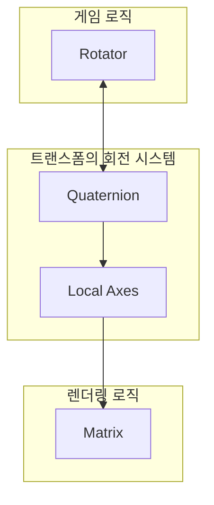

### 회전의 수학 I : 삼각함수와 회전변환

공간을 정의하고, 물체를 구성하고, 벡터 연산으로 관계를 계산할 수 있게 됐습니다. 
이제 마지막으로 물체를 **회전**시키려면 어떤 수학이 필요할까요?

---

#### 1. 회전 변환이란 무엇인가

앞서 벡터 공간의 모든 벡터는 **표준 기저 벡터의 선형 조합**으로 표현된다고 했습니다. 
이 말은 곧, 표준 기저 벡터가 바뀌면 공간 안의 모든 원소가 그 변화에 따라 함께 재배치된다는 뜻입니다.

회전 변환도 마찬가지입니다. 공간 전체를 회전시키는 것은 결국 **표준 기저 벡터를 회전시키는 것**과 같습니다.

그런데 회전할 때 물체의 모습이 변하면 안 됩니다. 늘어나거나 찌그러지지 않아야 하죠. 
이를 위해 표준 기저 벡터는 두 가지 성질을 반드시 유지해야 합니다:

```
① 크기가 1이어야 한다
② 서로 직교(90°)해야 한다
```

이 두 성질을 유지하면서 기저 벡터를 변환하면, 그것이 바로 **회전 변환**입니다.

> [!summary] 
> 게임에서의 변환은 물체가 움직이는 것이 아니고 **물체를 담은 공간이 움직인다.**
>
>회전 변환은 물체의 모습이 변하지 않도록 표준 기저 벡터의 성질을 유지하여 새로운 공간을 창조하는 작업이다.

---

#### 2. 단위 원과 삼각함수

크기가 1인 벡터들을 모두 나열하면 **단위 원(Unit Circle)** 이 형성됩니다. 즉, 단위 원 위의 모든 점은 크기가 1이라는 조건을 자동으로 만족합니다.

그럼 단위 원 위의 점 좌표를 어떻게 표현할까요? 여기서 **삼각함수**가 등장합니다.

직각삼각형에서 각도 θ에 따른 변들의 비율을 **삼각비**라고 합니다.
```
sin θ = 높이 / 빗변
cos θ = 밑변 / 빗변
```

단위 원에서는 빗변이 항상 1이므로
```
단위 원 위의 점 = (cosθ, sinθ)
```

> 💡 cos는 각도에 따른 **x축 성분**, sin은 각도에 따른 **y축 성분**입니다. 
> 삼각함수는 삼각형의 수학이기도 하지만, 게임에서는 **각도에 따라 x, y 성분이 얼마나 되는지** 알려주는 도구로 이해하는 게 더 중요합니다.

---

#### 3. 2차원 회전 행렬

이제 표준 기저 벡터를 각도 θ만큼 회전시키면 어떻게 될지 계산할 수 있습니다.

```
(1, 0)  →  (cosθ, sinθ)     ← 단위 원 위의 점
(0, 1)  →  (-sinθ, cosθ)    ← 위와 직교하는 벡터
```

두 번째 기저 벡터가 (-sinθ, cosθ)가 되는 이유는, 첫 번째 벡터와 크기 1, 직교라는 두 조건을 동시에 만족해야 하기 때문입니다.

임의의 점 (x, y)를 θ만큼 회전시킨 결과를 매번 수식으로 계산하면 복잡합니다. 그래서 변환된 표준 기저 벡터들을 **열로 나열해 행렬로 압축**합니다:

```
R(θ) = | cosθ  -sinθ |
       | sinθ   cosθ |
```

이것이 **2차원 회전 행렬**입니다. 어떤 점에든 이 행렬을 곱하면 θ만큼 회전한 새로운 좌표를 얻을 수 있습니다.

---

#### 4. 3차원 회전으로 확장하면

2차원 회전은 하나의 평면에서 이루어지기 때문에 비교적 단순합니다. 
하지만 3차원에서는 **임의의 2차원 평면을 설정하고 그 평면을 따라 회전**시켜야 하기 때문에 훨씬 **복잡**합니다. 게임에서는 주로 두 가지 방식을 사용합니다.

**① 축-각 회전 (Axis-Angle) — 로드리게스 회전 공식**

임의의 회전축을 설정하고, 그 축을 중심으로 해당 평면을 따라 회전시키는 방식입니다. 내적과 외적을 함께 사용합니다.

```
회전축 벡터 + 회전 각도 → 새로운 좌표
```

⚠️ 단, 로드리게스 회전 공식은 복잡하고 행렬로 만들기 어렵다는 단점이 있습니다.
행렬로 변환되지 않으면 렌더링 파이프라인의 흐름이 끊겨 효율이 떨어질 수 있습니다.

**② 오일러 각 (Euler Angles)**

X, Y, Z 세 축을 기준으로 각각 얼마나 회전했는지 순서대로 세 번 저장하는 방식입니다.

```
회전 = (X축 회전량, Y축 회전량, Z축 회전량)
```

직관적이고 데이터가 적어서 대부분의 3D 그래픽 툴에서 사용합니다. 
⚠️ 하지만 두 가지 문제가 있습니다.
- 임의의 축에 대해 부드러운 움직임을 표현하려면 매번 세 번씩 재계산해야 해서 비효율적입니다.
- **짐벌락(Gimbal Lock)** 현상이 발생할 수 있습니다.

---

#### 5. 짐벌락(Gimbal Lock)이란

오일러 각 방식의 치명적인 한계입니다. 세 축을 순서대로 회전시키다 보면 특정 각도에서 **한 축의 회전이 다른 축과 겹쳐버려 자유도가 하나 사라지는 현상**입니다.

```
X축 회전 → Y축 회전 → Z축 회전
                ↓
    특정 각도에서 두 축이 같은 평면에 겹침
                ↓
          자유도 1개 소멸 😱
```

#### 3차원 회전의 안정적인 구현을 위한 대안

두가지 방식 모두 결함이 있는 3차원 회전 문제를 해결하기 위해 수학자와 공학자들이 고안한 것이 바로 **사원수(쿼터니언, Quaternion)** 입니다.

---

#### 흐름 정리

```
표준 기저 벡터의 선형 조합 → 공간의 모든 벡터를 표현
  → 회전 변환 = 기저 벡터를 (크기 1, 직교) 유지하며 변환
    → 크기 1인 벡터들의 집합 = 단위 원
      → 단위 원 위의 점 = (cosθ, sinθ)
        → 2차원 회전 행렬로 압축
          → 3차원으로 확장
            → 축-각 회전 (행렬 변환 어려움)
            → 오일러 각 (직관적, 데이터 적음)
              → 짐벌락 문제 발생
```

---

### 🔄 회전의 수학 II : 사원수(Quaternion)

파트 1에서 오일러 각과 축-각 회전 방식이 각각 한계를 가진다는 것을 확인했습니다. 
이 두 방식의 문제를 동시에 해결하는 중간 지점의 솔루션이 바로 **사원수(Quaternion)** 입니다.

```
오일러 각   →  직관적이지만 짐벌락 발생, 부드러운 회전 표현 어려움
축-각 회전  →  직관적이지 않고 행렬 변환이 까다로움
```

두 방식 모두 단독으로 쓰기엔 문제가 있습니다. 사원수는 이 둘의 단점을 보완하면서 등장했습니다.

---

#### 2. 사원수를 이해하기 전에: 수란 무엇인가

사원수가 낯선 이유는 "4차원 수"라는 개념이 생소하기 때문입니다. 
그런데 사실 수의 정의를 알면 자연스럽게 받아들일 수 있습니다.

수는 집합의 관점에서 단순한 원소들의 모음일 뿐만 아니라, **사칙연산과 같은 연산 체계를 가진 구조**를 가진 집합입니다.
이러한 연산 체계의 성질을 만족하면 몇 개의 요소로 구성되든 "수"라고 부를 수 있습니다.

```
실수     →  1개의 요소
복소수   →  실수 + 허수(i) = 2개의 요소
사원수   →  실수 + 허수(i, j, k) = 4개의 요소
```

복소수가 실수에 허수 i를 더한 것처럼, 사원수는 복소수에서 개념을 확장해 세 종류의 허수(i, j, k)를 추가한 4차원 수 체계입니다.

$$ a + bi + cj + dk $$

---

#### 2. 크기가 1인 수와의 곱 = 회전

사원수를 이해하는 핵심 아이디어가 있습니다.

> **크기가 1인 수를 곱하면 회전이 일어난다**

이 원리가 실수 → 복소수 → 사원수로 확장되는 과정을 보면 명확해집니다.

**① 실수에서**

```
어떤 수 × 1   →  0도 회전 (그대로)
어떤 수 × -1  →  180도 회전
```

실수는 직선이라 회전의 의미가 제한적입니다.

**② 복소수에서**

실수를 x축, 허수 i를 y축으로 하는 **복소 평면**으로 확장하면, 크기가 1인 복소수는 삼각함수로 표현됩니다.

```
크기가 1인 복소수 = cosθ + i sinθ
```

그리고 임의의 복소수에 이 값을 곱하면 **평면에서 θ만큼 회전**이 일어납니다. 복소수의 곱셈 연산이 회전 변환 공식과 정확히 일치하기 때문입니다.

**③ 사원수에서**

아일랜드 수학자 해밀턴이 10년간의 연구 끝에 발견했습니다. 
크기가 1인 사원수의 곱은 **4차원 공간의 임의의 회전**을 나타냅니다.

```
사원수 = w + xi + yj + zk
→ 3차원 공간에서 i, j, k를 각각 x, y, z 축에 대응
→ 나머지 차원(w)은 회전 각도 정보를 담음
```

사원수의 곱셈 연산은 내적과 외적으로 요약됩니다. 
앞서 배운 내적과 외적이 여기서 다시 연결되는 것입니다.

3차원 공간의 회전은 구체적으로 이렇게 표현됩니다.

```
회전 = q × v × q⁻¹
→ q       : 각을 절반으로 나눈 크기가 1인 사원수
→ q⁻¹    : q의 반대 방향 사원수
→ 결과    : 외적 식으로 정리되어 게임 엔진의 기본 회전 공식이 됨
```

---

#### 3. 사원수의 장점

```
① 빠른 계산     →  외적 연산 기반으로 빠르고 간편하게 처리
② 짐벌락 없음   →  축을 순서대로 회전시키지 않아 자유도 손실 없음
③ 부드러운 회전 →  임의의 축에 대해 자연스러운 보간 가능
④ 행렬 변환 용이 →  렌더링 파이프라인으로 매끄럽게 연결
```

---

#### 4. 게임 엔진에서의 활용

사원수는 강력하지만 직관적이지 않습니다. 그래서 게임 엔진은 이렇게 설계되어 있습니다.

```
내부 계산   →  사원수로 처리 (빠르고 안정적)
사용자 화면 →  오일러 각으로 변환해서 표시 (직관적)
```

유니티나 언리얼에서 Inspector 창에 X, Y, Z 회전값으로 보이는 것이 오일러 각이고, 
내부적으로는 전부 사원수로 계산되고 있는 겁니다.


