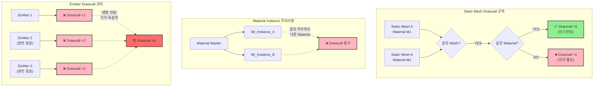

## 드로우콜 계산방식

드로우콜이 많아질수록 Frame Rate가 급격히 떨어져 최적화의 최우선 고려사항입니다.

Drawcall은 뷰포트에서 출력되는 것만 해당됩니다.
즉, 레벨에 배치되어있지만 카메라 영역 밖에 있어서 뷰포트에 나오지 않으면 Drawcall도 발생하지 않습니다.

같은 Static Mesh, 같은 Material은 추가적인 Drawcall이 발생하지 않습니다.
Material Instance는 부모가 같아도 다른 Material입니다.
만약 Static Mesh 2개를 배치했을 때, Mesh는 같고 Material이 다를 경우 Drawcall은 3입니다.

Emitter 하나 당 예외없이 추가적으로 Drawcall은 2씩 증가합니다.  
즉 완전 똑같은 Emitter 2개가 있어도 1개처럼 취급되지 않고 각각 추가적인 Drawcall이 발생합니다.



> [!tip]
> 
>```
>stat RHI
>```
> Drawcall의 할당량(DrawPrimitive calls)을 디버깅할 수 있습니다.


## 드로우콜 문제점

언리얼 엔진의 렌더링 과정은 CPU가 선작업하고 넘겨주면 GPU 후작업하는 방식으로 진행됩니다.

이 때 CPU가 처리할 소스가 많으면 GPU는 CPU작업이 끝날 때까지 유후상태(냉각상태) 빠지게 됩니다. 그릴 픽셀이 많다면 콜의 상대적으로 낮은 경우에도 충분히 일어날 수 있습니다.

- 프로파일링 관점에서 Drawcall이 높으면 80-90퍼 성능이 저하됩니다.
<br>
- Drawcall은 하드웨어콘솔과 API말곤 개선의 여지가 없습니다.
<br>
- Cash Memory는 프로파일링에서 매우 범용적입니다.
	- 이번에 보낼 Call의 내용을 저장해두는 것도 Cash Memory의 하나의 형태입니다.


