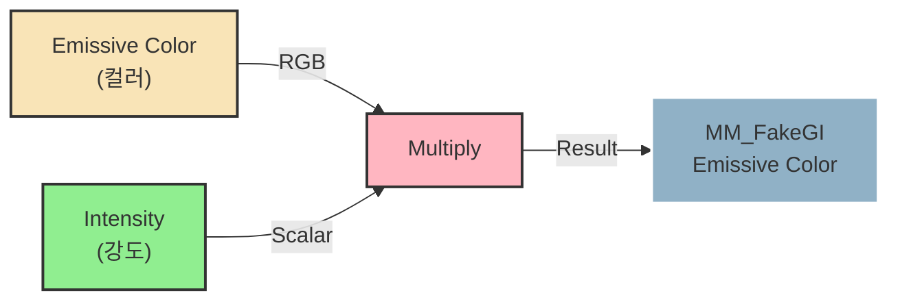

Unreal Engine 5에서 도입된 Lumen은 실시간 글로벌 일루미네이션(GI) 시스템입니다.
Fake GI 테크닉은 Lumen의 간접광이 전역적으로 계산되는 특성을 활용하여, 보이지 않는 Emissive Material를 장면의 암부(어두운 영역)에 배치해서 자연스럽게 간접광을 추가하는 방법입니다.

이 기법을 통해 직접광을 사용하는 것보다 더 부드럽고 자연스러운 간접광 효과를 만들 수 있습니다.

## 설정 방법

언리얼에서 넓은 Plane 또는 Box Mesh 배치합니다.
그리고 Fake GI를 구현하기 위해서는 디테일 패널에서 다음과 같이 오브젝트를 설정해야 합니다.

#### 오브젝트 세팅

**Hidden In Game**: 체크 ✅
게임 실행 시 오브젝트가 화면에 보이지 않도록 설정합니다.

**Affect Indirect Lighting While Hidden**: 체크 ✅
오브젝트가 숨겨진 상태에서도 간접광 계산에 영향을 미치도록 설정합니다.
이 옵션이 Fake GI의 핵심입니다.

#### 머티리얼 세팅

Material을 생성하고 Emissive Color를 연결하여 발광 강도와 색상을 조절합니다.

**연결 구조**

---

## 특징

#### 장점

- 직접적인 라이트 소스를 추가하지 않고도 간접광 효과를 얻을 수 있습니다.
- Lumen의 간접광 범위를 세밀하게 제어할 수 있습니다.
- 직접광보다 자연스러운 Fill Light 효과를 연출할 수 있습니다.

#### 주의사항

기본적으로 **면적이 충분히 크고, 과도하게 밝지 않은 Emissive 발광체를 사용하는 것이 안정적인 결과를 얻는 데 유리합니다.**

> [!error] **GI Artifact 방지**
> Lumen에서 크기가 작고 밝기가 강한 발광체일수록 GI 노이즈를 발생시킬 수 있습니다.
> > [!tip]
> >Emissive는 런타임 라이트보다 비용이 낮지만, 발광 면적이 작을수록 샘플링이 불안정해진다.

> [!error] **Lumen Scene 문제 방지**
>  발광체의 크기가 작을수록 특정거리에서 발광체가 갑자기 사라지는 현상이 발생합니다. 
>  이는 Lumen이 씬을 단순화하여 계산하는 구조와 관련이 있는데 작은 메쉬는 거리 기반 최적화 과정에서 제거되거나 단순화되기 쉽기 때문입니다.
>  
> 이 경우 **Post Process → GI - Lumen Scene Detail**의 값을 2~4정도로 올리면 개선할 수 있어요. 
> 또한 발광체의 면적이 클수록 원거리에서도 발광체에 의한 간접광이 안정적으로 적용됩니다. 

---

## 새까만 암부를 보정하는 두가지 대안

모든 세팅을 완료한 후에도 암부가 여전히 새까맣다면, Post Process에서 최종 보정을 할 수 있습니다.

#### 옵션1. Sky Light Leaking

Post Process Volume의 Lumen GI 설정에서 Sky Light Leaking 값을 조정하여 Fill Light 효과를 얻을 수도 있습니다.

**설정 위치**: Post Process Volume → Lumen GI - [Sky Light](app://obsidian.md/Sky%20Light) Leaking
**예시값**: 0.02 (간접광이 전반적으로 밝아집니다)
이 방법은 Fake GI와 병행하여 사용할 수 있으며, 장면의 전반적인 암부 톤을 조정하는 데 유용합니다.

#### 옵션2. Local Expoure - Shadow Contrast

**Post Process Volume 설정**:
- Local Exposure 탭에서 Shadow Contrast을 조절합니다.
- 권장값: 0.8 (0.5 이하로 과도하게 조정하면 부자연스러울 수 있습니다)
- 레벨 전체에 균일하게 적용되어야 일관성 있는 결과를 얻을 수 있습니다.

---

**참고자료**
- [Hidden Emissive Light using Lumen Not Working](https://www.reddit.com/r/unrealengine/comments/1anbkqc/hidden_emissive_light_using_lumen_not_working)
- [Emissive lighting with a hidden/invisible object - Development / Rendering - Epic Developer Community Forums](https://forums.unrealengine.com/t/emissive-lighting-with-a-hidden-invisible-object/852873)
- https://forums.unrealengine.com/t/strange-indirect-lighting-from-animated-emissive-material-in-5-1/1183162

