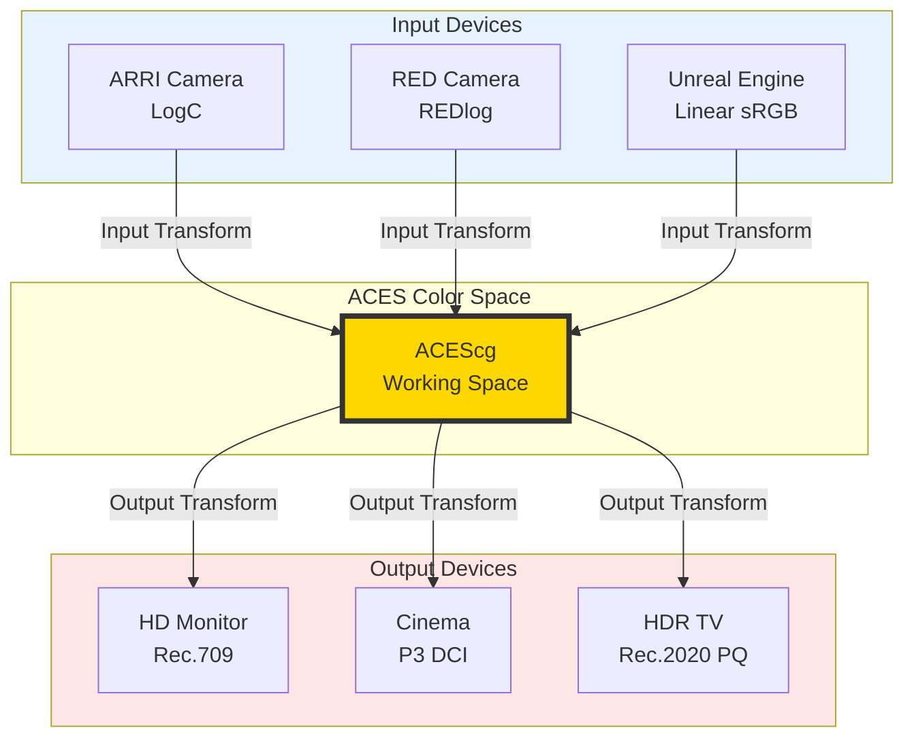
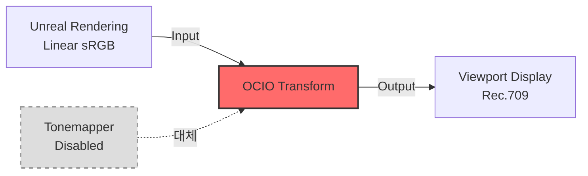

---
aliases:
  - OpenColorIO
date: 2025-02-24
tags:
  - Unreal
  - Composition
  - Rendering
---

언리얼 뷰포트에서 보던 색과 최종 렌더 결과가 다르게 나오는 경험은 한 번쯤 있지않으신가요
특히 버츄얼 프로덕션이나 VFX 파이프라인처럼 여러 툴과 장비를 거치는 환경에서는, 작은 색공간 차이 하나가 전체 결과를 바꿔버리기도 합니다.
이 문서에서는 Unreal Engine에서 OCIO를 기반으로 색을 일관되게 관리하고, 뷰포트·렌더·후반 작업까지 동일한 기준 위에 올려두는 방법을 정리하려고 합니다.

OpenColorIO(OCIO)는 제작 전 과정에서 색을 일관되게 유지하기 위한 색 관리 시스템입니다. 
카메라로 촬영한 영상, CG 렌더링 결과, 합성 툴에서의 작업, 그리고 최종 납품 디스플레이까지 서로 다른 장치와 소프트웨어를 거치더라도 색이 예측 가능하게 유지되도록 규칙을 정의합니다.

영화 및 가상 제작 환경에서는 주로 ACES(Academy Color Encoding System) 표준과 함께 사용됩니다. ACES는 입력 장치의 색을 공통 작업 색공간으로 변환한 뒤, 최종 출력 장치에 맞게 다시 변환하는 구조를 가진다. 이 구조 덕분에 ARRI LogC, RED Log, Unreal의 Linear sRGB 같은 서로 다른 소스가 하나의 일관된 체계 안에서 관리될 수 있죠.

Unreal Engine에서는 OCIO를 통해 기본 렌더링 결과(Linear sRGB)를 ACEScg와 같은 작업 색공간으로 변환하고, 다시 Rec.709나 P3 같은 최종 디스플레이 색공간으로 정확히 매핑할 수 있습니다.

Movie Render Queue로 ACEScg EXR을 출력하면 Nuke나 Resolve 같은 후반 작업 툴에서도 동일한 색 체계를 유지할 수 있습니다. 이렇게 하면 뷰포트에서 보던 이미지와 최종 합성·그레이딩 결과 사이의 차이를 줄일 수 있습니다.

## OCIO 설정 파일의 이해

📥 [OCIO](https://bit.ly/3Flrurp) 
📥 [ACES 1.2 Config](https://github.com/colour-science/OpenColorIO-Configs/releases/download/v1.2/OpenColorIO-Config-ACES-1.2.zip)
📥 [ACES 1.2 Github](https://github.com/colour-science/OpenColorIO-Configs/releases/tag/v1.2)

OCIO의 핵심은 **Configuration 파일**입니다. 이 파일은 YAML 형식으로 작성되며, 
프로젝트에서 사용할 모든 색공간과 그들 간의 변환 규칙을 정의합니다. 
[ACES 1.2 Config](https://github.com/colour-science/OpenColorIO-Configs/releases/download/v1.2/OpenColorIO-Config-ACES-1.2.zip)를 다운로드해보면, `config.ocio` 파일 안에 수백 개의 색공간 정의가 담겨 있는 것을 확인할 수 있습니다.

> [!info] ACES 워크플로우의 구조
> ACES(Academy Color Encoding System)는 미국 영화예술과학아카데미(AMPAS)가 제정한 색상 표준으로, 현재 헐리우드 대부분의 제작사가 채택하고 있습니다.
> 
> **Input Transform**: 카메라나 CG 렌더러의 색공간을 ACES 색공간으로 변환
> - ARRI LogC, RED REDlogFilm, CG의 경우 ACEScg
> 
> **Working Space**: 실제 작업이 이루어지는 색공간
> - ACEScg: 넓은 색역(Wide Gamut)과 장면 참조(Scene-Referred) 특성
> - HDR 콘텐츠 제작에 최적
> 
> **Output Transform**: 최종 디스플레이 장치에 맞게 색상 변환
> - Rec.709 (HD TV), Rec.2020 (UHD TV), P3 (영화관)

현장에서는 프로젝트의 납품 규격에 따라 적절한 OCIO Config를 선택해야 합니다. 

## 1단계: 언리얼 엔진에서의 OCIO 설정

언리얼 엔진에서 OCIO를 활성화하려면 먼저 **OpenColorIO 플러그인**을 활성화해야 합니다. Edit → Plugins 메뉴에서 "OpenColorIO"를 검색하여 체크한 후 에디터를 재시작합니다. 플러그인이 활성화되면, 콘텐츠 브라우저에서 새로운 에셋 타입인 **OpenColorIO Configuration**을 생성할 수 있게 됩니다.

> [!tip] OCIO 설정 단계
> 1. **Plugins 활성화**: Edit → Plugins → "OpenColorIO" 검색 후 체크
> 2. **Configuration 생성**: 콘텐츠 브라우저 우클릭 → 기타 → OCIO Configuration
> 3. **Config 파일 로드**: Configuration File에 `config.ocio` 파일 지정
> 4. **색공간 추가**: 원하는 컬러스페이스에서 프로젝트에 필요한 색공간 추가

![[Desired Color Space.png|300]]

일반적인 CG 워크플로우에서는 다음과 같은 색공간들을 추가합니다:
- **Utility - Linear - sRGB**: 언리얼 엔진의 기본 작업 색공간입니다. 대부분의 텍스처와 머티리얼은 sRGB로 작성되므로, 이를 선형 색공간으로 변환하여 라이팅 계산을 수행합니다.
- **ACES - ACEScg**: 씬의 라이팅과 렌더링이 수행되는 작업 색공간입니다. 선형 특성을 가지며, 음수 값과 1 이상의 값을 표현할 수 있어 HDR 작업에 필수적입니다.
- **ARRI - V3 LogC (EI800)**: ARRI 카메라로 촬영된 실사 플레이트를 사용하는 경우 필요합니다. LogC는 카메라 센서의 전체 다이나믹 레인지를 효율적으로 저장하는 로그 인코딩 방식입니다.

## 2단계: 뷰포트에서의 실시간 컬러 프리뷰

![[OCIO_Display.png|500]]

OCIO Configuration을 생성했다면, 이제 **뷰포트에서 실시간으로 최종 출력 색공간을 프리뷰**할 수 있습니다. 뷰포트 상단의 View Mode 드롭다운에서 **OCIO Display**를 선택하면, OCIO 설정 패널이 나타납니다. 여기서 앞서 만든 OCIO Configuration 에셋을 선택하고, Input과 Output 색공간을 지정합니다.

일반적인 설정은 다음과 같습니다.
- **Input Color Space**: Utility - Linear - sRGB
- **Output Color Space**: ACES - Rec.709 (또는 최종 납품 색공간)

이렇게 설정하면 언리얼의 선형 sRGB 렌더링 결과가 ACES를 거쳐 Rec.709로 변환되어 화면에 표시됩니다. 중요한 점은 **OCIO Display가 활성화되면 엔진의 기본 톤맵핑이 비활성화**된다는 것입니다. 따라서 OCIO 없이 작업하던 씬을 OCIO로 전환하면 밝기와 색감이 달라 보일 수 있으며, 이는 정상적인 현상입니다.

> [!warning] 톤맵핑 중복 방지
> 
> OCIO Display를 활성화하면 언리얼의 기본 Filmic Tonemapper가 자동으로 비활성화됩니다. 
> 이 때 Post Process Volume의 * "Blue Correction", "Expand Gamut" and "Tone Curve Amount"가 1.0으로 설정되어 있다면 반드시 0으로 내려야 합니다. 
> 두 톤맵퍼가 동시에 적용되면 이미지가 지나치게 어두워지거나 대비가 과도하게 증가합니다.

## 3단계: Movie Render Queue 설정

![[Color output for nuke.png|500]]
[[Movie Render Queue]]는 언리얼 5의 고품질 시퀀스 렌더링 시스템으로, 시네마급 퀄리티의 출력을 위한 다양한 기능을 제공합니다. 
MRQ에서 시퀀스를 렌더링할 때, **Color Output** 섹션에서 Source와 Destination 색공간을 지정할 수 있습니다.

일반적인 VFX 파이프라인에서는 다음과 같이 설정합니다.
- **Source Color Space**: Utility - Linear - sRGB (언리얼의 기본 렌더링 색공간)
- **Destination Color Space**: ACES - ACEScg

이렇게 설정하면 렌더링된 EXR 파일이 **ACEScg 색공간으로 저장**됩니다. ACEScg는 Nuke, Fusion, After Effects 같은 컴포지팅 툴에서 표준으로 사용되는 작업 색공간이므로, 다운스트림 작업자들이 별도의 색공간 변환 없이 바로 사용할 수 있습니다. 

%%Unreal은 내부적으로 이미 ACES Filmic Tonemapper 기반 렌더 파이프라인을 사용한다.%%

> [!error] **뷰포트와 렌더링 결과가 다른 경우**
> 
> 뷰포트의 OCIO Display 설정과 MRQ의 Color Output 설정이 일치하는지 확인해야 합니다. 
> 특히 Output 색공간이 다르면 전혀 다른 결과가 나올 수 있습니다. 
> 
> 또한 Post Process Volume의  "Blue Correction", "Expand Gamut" and "Tone Curve Amount"가 1.0으로 설정되어 있다면 0으로 내려야 합니다. OCIO가 톤 매핑을 담당하므로, 언리얼의 톤 커브가 동시에 적용되면 이중 적용되어 어두워집니다.

#### V3 LogC vs ACEscg

![[v3.png]]![[ACEscg.png]]

위 이미지는 동일한 씬을 V3 LogC와 ACEScg로 각각 렌더링한 결과입니다. 
LogC는 평탄한(Flat) 색조 곡선을 가지고 있어 컬러 그레이딩의 여지가 많지만, 모니터에서 직접 보기에는 대비가 낮고 채도가 떨어져 보입니다. 
반면 ACEScg는 선형 색공간이면서도 적절한 색역을 가지고 있어, ACES Output Transform을 거치면 즉시 시청 가능한 이미지가 됩니다. 

프로젝트의 파이프라인에 따라 적절한 색공간을 선택해야 하며, 
DI 단계에서 전면적인 컬러 그레이딩을 계획하고 있다면 LogC가, 
렌더링 단계에서 최종에 가까운 룩을 완성하려면 ACEScg가 적합합니다.

---

## 4-A. Davinch Resolve ACES 워크플로우 기본설정

> [!check] DaVinci Resolve ACES 설정
> **Project Settings → Color Management**
> - Color Science: **ACEScct** (ACES Color Correction Transform)
> - ACES Version: **ACES 1.2** (또는 프로젝트 표준)
> - ACES Input Transform: **No Input Transform**
> - ACES Output Transform: **Rec.709** (최종 납품 타겟)
>

**ACEScct**는 ACEScg의 로그 버전으로, 컬러 그레이딩 작업에 최적화되어 있습니다. 선형 색공간에서는 어두운 영역의 조정이 어렵지만, 로그 색공간에서는 전체 톤 범위를 균등하게 다룰 수 있습니다. Input Transform을 "No Input Transform"으로 설정하는 이유는, 언리얼에서 이미 ACEScg로 렌더링했기 때문입니다. 만약 카메라 RAW 푸티지를 작업한다면, 여기서 ARRI LogC나 RED Log3G10 같은 적절한 Input Transform을 선택해야 합니다.

> [!check]
> **Clip 우클릭  → ACES Input Transform**
> - Color Spece Conversion: **ACEScg-CSC**

타임라인에 클립을 임포트한 후, 각 클립의 색공간을 개별적으로 설정할 수도 있습니다. 클립을 우클릭하고 **ACES Input Transform**에서 **Color Space Conversion → ACEScg-CSC**를 선택하면, 해당 클립이 ACEScg 색공간으로 해석됩니다. 이는 프로젝트 설정보다 우선하므로, 다양한 소스의 푸티지를 혼합할 때 유용합니다. 예를 들어 언리얼 렌더링은 ACEScg로, 실사 푸티지는 LogC로 각각 설정하여 하나의 타임라인에서 작업할 수 있습니다.

---

## 4-B. After Effects에서의 32-bit Float 워크플로우 기본설정

#### 프로젝트 세팅

After Effects에서 OCIO와 ACES를 활용하려면 **32-bit per channel (float)** 모드로 작업해야 합니다.
Project Settings에서 **Depth를 32 bits per channel (float)**로 설정하면, ACEScg의 확장된 색역과 HDR 값을 손실 없이 다룰 수 있습니다.

> [!tip] After Effects 32-bit Float 설정
> **Project Settings**
> - **Depth**: 32 bits per channel (float)
>   - 1.0 이상의 HDR 값 표현 가능
>   - 블룸, 글레어 효과의 자연스러운 처리
> - **Working Space**: sRGB IEC61966-2.1
> - **Linearize Working Space**: Enable
>   - 선형 색공간에서 합성 연산 수행
>   - 물리적으로 정확한 블렌딩

32-bit float의 장점은 **1.0 이상의 값을 표현**할 수 있다는 것입니다. 
일반적인 LDR 이미지에서 흰색은 1.0으로 클리핑되지만, HDR 이미지에서는 태양이나 하이라이트가 10, 100, 심지어 1000 이상의 값을 가질 수 있습니다. 이러한 값들은 블룸, 글레어, 렌즈 플레어 같은 효과를 자연스럽게 만드는 데 필수적입니다. 
32-bit 모드에서는 글로우 효과를 적용할 때 하이라이트가 주변으로 자연스럽게 번지지만, 8-bit에서는 클리핑된 흰색이 그대로 확산되어 부자연스럽습니다.

**Working Space를 sRGB IEC61966-2.1**로 설정하고 **Linearize Working Space를 활성화**하는 것도 중요합니다. 이렇게 하면 After Effects가 내부적으로 선형 색공간에서 합성 연산을 수행하게 되어, 블렌딩과 컬러 작업이 물리적으로 정확해집니다. 예를 들어 두 레이어를 50% 투명도로 오버랩할 때, 비선형 색공간에서는 중간 톤이 어둡게 나오지만, 선형 색공간에서는 에너지 보존 법칙에 따라 정확한 중간값이 나옵니다.

---
**참고자료**
- [언리얼 엔진의 컬러 그레이딩과 필름 톤매퍼](https://dev.epicgames.com/documentation/en-us/unreal-engine/color-grading-and-the-filmic-tonemapper-in-unreal-engine)
- [OCIO implementation]( https://forums.unrealengine.com/t/4-26-ocio-implementation/154561)
- [컬러 파이프라인 & OpenColorIO - 선형 콘텐츠 제작 기술 가이드: 파이프라인 개발](https://dev.epicgames.com/community/learning/courses/qEl/unreal-engine-technical-guide-to-linear-content-creation-pipeline-development/KJZk/unreal-engine-color-pipeline-opencolorio)
- [인카메라 VFX를 위한 카메라 컬러 캘리브레이션](https://dev.epicgames.com/documentation/ko-kr/unreal-engine/camera-color-calibration-for-in-camera-vfx-in-unreal-engine)