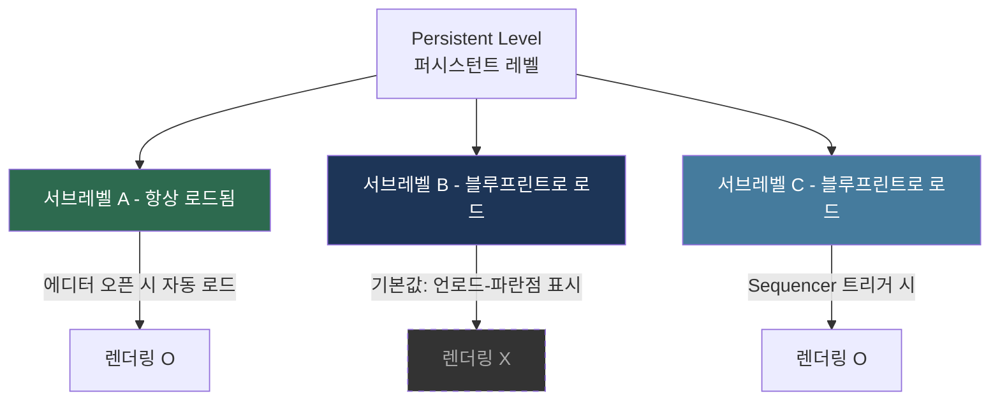
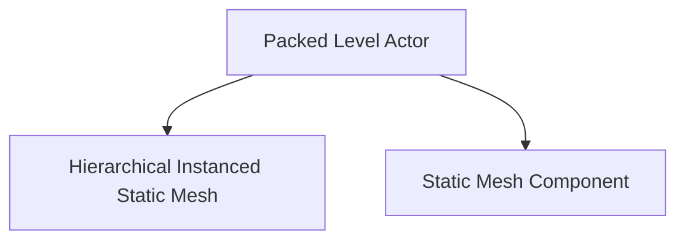
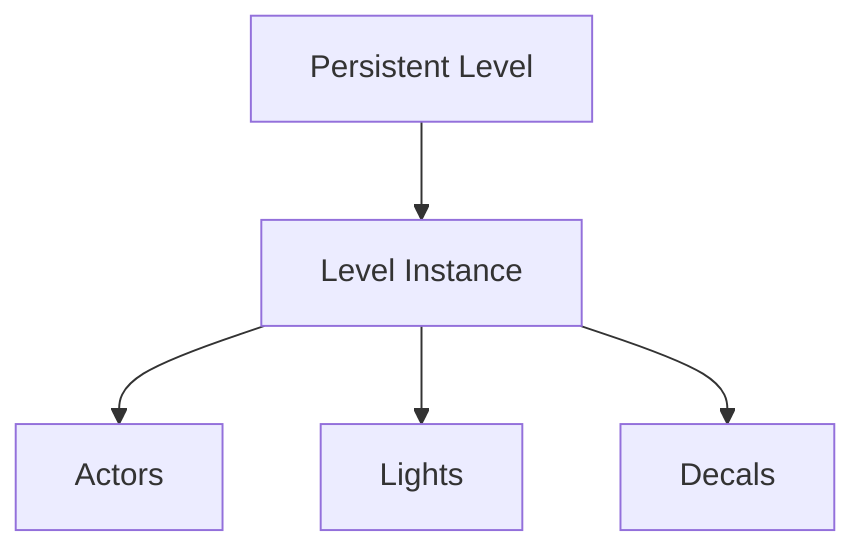

---
aliases:
  - Level Streaming
date: 2026-02-27
tags:
  - Unreal
  - Config
---
Relevant notes:: [[Level Editor]]

렌더링 결과물을 열었는데 세트가 통째로 사라져 있던 적이 있습니다. 
뷰포트에서는 분명히 보였는데, 렌더만 하면 뿅 사라지는 상황...처음엔 에셋 문제인 줄 알고 한참 헤맸습니다.

원인은 허무할 정도로 단순했습니다. **스트리밍 방식 설정 하나**였습니다.

언리얼에서 레벨은 메모리에 올라와야만 존재합니다. 뷰포트에서 보이는 것과 실제로 로드된 것은 다를 수 있고, 그 차이를 만드는 게 스트리밍 설정입니다. 이 개념을 제대로 잡아두면 비슷한 상황에서 훨씬 빠르게 원인을 찾을 수 있습니다. 레벨 스트리밍의 개념과 레벨 관리 옵션들을 하나씩 정리해보겠습니다.

## 레벨 스트리밍

언리얼에서 대규모 레벨 작업은 퍼시스턴트 레벨(Persistent Level) 아래에 서브레벨을 붙이고, 각 서브레벨의 스트리밍 방식을 불러오는 방식으로 구성됩니다.

이때 레벨 스트리밍의 목적은 **메모리 로드와 언로드를 제어하는 것**입니다.

서브레벨의 스트리밍 방식은 레벨 창(Levels Panel)에서 레벨을 우클릭하면 **스트리밍 상태(Streaming Method)** 에 대한 옵션이 나오는데 다음 두 가지로 접근할 수 있습니다. 

#### 블루프린트로 로드

“렌더링하지 않는 레벨”을 설정할 때는 보통 스트리밍 상태를 **블루프린트로 로드(Blueprint)**로 둡니다.
**블루프린트로 로드(Blueprint)** 상태는 레벨을 기본적으로 언로드 상태로 유지하고, 블루프린트 혹은 시퀀서 등 외부 로직이 명시적으로 요청할 때만 메모리에 올립니다. 

❗ 에디터 뷰포트에서 이 상태의 레벨 아이콘 옆에 **파란색 점**이 표시되는데, 이것은 "현재 로드되지 않은 상태"를 나타냅니다.

#### 항상 로드됨

반대로 “항상 렌더링되어야 하는 레벨”은 **Always Loaded**로 설정합니다.

**항상 로드됨(Always Loaded)** 상태는 퍼시스턴트 레벨이 열리는 순간 해당 서브레벨도 함께 메모리에 올라옵니다. 렌더링이 반드시 필요한 레벨 (배경 전체를 구성하는 환경 레벨이나 라이팅 레벨 등)은 이 옵션으로 지정하는 것이 안전합니다.

---

## 시퀀서에서 레벨 스트리밍 비지빌리티 트랙 활용하기

시네마틱 작업에서 특정 샷에만 등장하는 세트나 소품 레벨을 관리할 때, **시퀀서의 레벨 비지빌리티 트랙(Level Visibility Track)** 은 굉장히 유용한 도구입니다. 
이 트랙을 통해 샷 구간에 맞춰 서브레벨의 로드·언로드 타이밍을 키프레임으로 제어할 수 있습니다.

주의해야 할 점은 트랙 추가 후 레벨 이름을 **반드시 수동으로 입력**해야 한다는 것입니다. 
트랙의 섹션을 우클릭하면 "레벨 이름 설정" 옵션이 나타나며, 여기에 **서브레벨의 에셋 이름**(파일명 기준, 경로 제외)을 정확히 입력해야 정상 작동합니다. 
자동 완성이 되지 않으므로 레벨 창에서 이름을 미리 복사해두는 습관을 들이면 오타로 인한 시간 낭비를 줄일 수 있습니다.

![[Sequence Level Visiblity.png]]

이 트랙이 제어하는 것은 비지빌리티(Visibility)이지만, 내부적으로는 **스트리밍 상태가 "블루프린트로 로드"로 설정된 레벨의 로드·언로드 명령**을 시퀀서가 대신 발행하는 방식입니다. 
따라서 해당 서브레벨의 스트리밍 방식이 "블루프린트로 로드"로 설정되어 있어야만 시퀀서가 제어권을 가집니다. "항상 로드됨"으로 설정된 레벨은 이 트랙의 영향을 받지 않습니다.

> [!tip] 💡 **팁** 
> 렌더링 목적으로 시퀀서를 쓴다면, 렌더링할 레벨은 "항상 로드됨"으로, 샷별로 조건부 등장하는 세트 레벨은 "블루프린트로 로드"로 설정한 뒤 레벨 비지빌리티 트랙으로 제어하는 이중 구조가 가장 안정적입니다.

---
## 레벨 인스턴스: Packed Level Actor vs Level Instance

> [!summary] 
> **퍼포먼스가 최우선이고 라이팅과 데칼이 필요 없는 소품 그룹이라면 Packed Level Actor**, 
> **조명과 마감재가 포함된 완성된 세트 단위의 재사용이라면 Level Instance**가 적절한 선택입니다.

레벨 인스턴스는 여러 에셋을 하나의 단위로 묶어 재사용하는 기능입니다. 동일한 세트 구성을 여러 샷에 반복 배치하거나, 모듈식 배경 제작에 매우 유용합니다. 
언리얼에는 이 목적을 위한 두 가지 유형이 존재하며, 이 둘의 차이를 명확히 이해하지 않으면 라이팅 손실이나 데칼 누락 같은 예상치 못한 문제가 생길 수 있습니다.

#### Packed Level Actor

**Packed Level Actor**는 스태틱 메시를 중심으로 한 인스턴스 그룹입니다.

내부의 스태틱 메시들을 ISM(Instanced Static Mesh) 혹은 HISM으로 병합하여 드로우콜을 줄이는 것이 주된 목적이며, 퍼포먼스 최적화 측면에서 강점이 있습니다. 그러나 **라이트 액터와 데칼은 패킹 과정에서 제외**됩니다. 
라이팅이 포함된 소품 세트나 데칼로 마감된 벽면 구성을 Packed Level Actor로 만들면 라이트와 데칼이 사라진 채로 배치되기 때문에, 조명과 표면 디테일이 중요한 세트에는 적합하지 않습니다.

#### Level Instance

**Level Instance**는 개념적으로 퍼시스턴트-서브레벨 관계와 동일한 구조를 인스턴스 단위로 구현한 것입니다. 

서브레벨처럼 독립적인 레벨 에셋(.umap)으로 존재하며, 뷰포트에 배치할 때 해당 레벨 전체가 인스턴스로 올라옵니다. 라이트, 데칼, 블루프린트 액터 모두 포함되기 때문에 **씬 구성 요소 전체를 패키지처럼 재배치**하는 용도에 적합합니다. 편집이 필요할 때는 인스턴스를 더블클릭해 내부 레벨 편집 모드로 진입할 수 있으며, 변경사항은 원본 레벨 에셋에 반영되어 같은 레벨 인스턴스를 사용하는 모든 배치에 동기화됩니다.

---
**참고자료**
- [Unreal Engine Docs — Level Streaming Overview](https://dev.epicgames.com/documentation/en-us/unreal-engine/level-streaming-overview-in-unreal-engine)
- [Unreal Engine Docs — Level Instancing](https://dev.epicgames.com/documentation/en-us/unreal-engine/level-instancing-in-unreal-engine)
- [Unreal Engine Docs — Sequencer Level Visibility Track](https://dev.epicgames.com/documentation/en-us/unreal-engine/cinematic-level-visibility-track-in-unreal-engine)